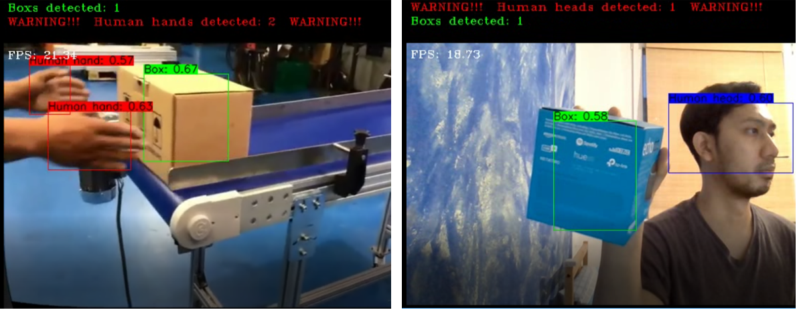

# TFLite YOLOv4
Modified TFLite Yolov4 detector for Thesis's purposes at my campus HTW Berlin

DISCLAIMER: This repository is very similar to the repository TheAIGuysCode: [yolov4-custom-functions](https://github.com/theAIGuysCode/yolov4-custom-functions). I created this repository to add a new feature to be implemented with my custom YOLOv4-tiny model, and they may worsen the overal speed of the application and make it not optimized in respect to time complexity.

### Details
The classes of the custom model are: Human Hand, Human Head and Box.

The model name is yolov4-tiny3l-416-opt.tflite on checkpoints folder.

The custom model was built with the help of repository [darknet](https://github.com/AlexeyAB/darknet)

The training dataset: https://drive.google.com/file/d/1VF395rUGB-jyyqnhpqbot3r3rfzGyfrS/view?usp=sharing

The validation/test dataset: https://drive.google.com/file/d/1JL3GrLlmX4_WK6FF9Lfn674GFJjNPW5w/view?usp=sharing

The obj.names: https://drive.google.com/file/d/1EApt6uUKIGP3rxLs26Th2DEI8jmMQ-K5/view?usp=sharing

### Features
The detector will show us how many objects of each class are being detected and also;

The "Warning" text if human hand and or human head is detected on the video or live webcam.

### The Looks
Check out how the detector looks like

